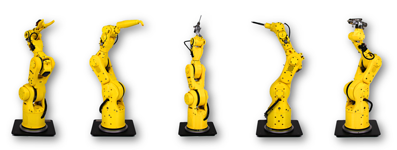

# PROBOT Anno

This repository provides ROS support for PROBOT Anno.   
This repo holds source code for ROS versions Kinetic and Melodic.



### __Wiki for PROBOT Anno Packages__ 
- http://wiki.ros.org/Robots/PROBOT_Anno


### __Operating System Install__  
Operating system version is not less than Ubuntu linux 14.04, both supports 32bit and 64bit system.
Ubuntu Linux download:http://www.ubuntu.com/download/

Please install git and clone repo before the following steps:
```sh
$ sudo apt-get install git
$ git clone https://github.com/ps-micro/PROBOT_Anno
```

### __Setup Environment__
Choose one of the following ways to install.

__Install With Script(Recommended)__  
1. Run PROBOT [install.sh](https://github.com/ps-micro/PROBOT_Anno/install.sh)
```sh
PROBOT Setup Assistant[v1.0.0]
---- www.ps-micro.com ----

  0. Install ROS
  1. Install PROBOT dependent packages
  2. Install PROBOT packages
-------------------
  3. Install all environment
    
[Warn] The system version: Ubuntu 16.04.5 LTS
[Warn] The ROS version: kinetic

please choose [0~3]：
```
2. Choose '3' to install all environment(include 0，1,2).   
3. Besides, you can choose 0~2 to install the separate step with own wishes.   
4. If setup fails, please try again.

__Install With Commands__  

1. Install ROS Desktop-Full with [this tutorials](http://wiki.ros.org/kinetic/Installation/Ubuntu)   

2. Install Dependant Packages:   
```sh
    $ ROS_VERSION=`/usr/bin/rosversion -d`   
    $ sudo apt-get install ros-${ROS_VERSION}-moveit-*   
    $ sudo apt-get install ros-${ROS_VERSION}-industrial-*   
    $ sudo apt-get install ros-${ROS_VERSION}-gazebo-ros-control   
    $ sudo apt-get install ros-${ROS_VERSION}-ros-control ros-${ROS_VERSION}-ros-controllers   
    $ sudo apt-get install ros-${ROS_VERSION}-trac-ik-kinematics-plugin   
    $ sudo apt-get install ros-${ROS_VERSION}-usb-cam   
```

3. Install PROBOT Packages:   
- Set up a catkin workspace (see [this tutorials](http://wiki.ros.org/catkin/Tutorials)).
- Clone the repository into the src/ folder of workspace   
- Use "catkin_make" to build workspace
- Copy probot_rviz_plugin/plugin/libprobot_rviz_plugin.so to 'WORKSPACE_PATH'/devel/lib
- Set up environment variables:   
```sh
$ echo "source ~/'WORKSPACE_PATH'/install/setup.bash" >> ~/.bashrc
$ source ~/.bashrc
```

__Install Librarys__  

1. Install OpenCV   


### __MoveIt! with a simulated robot__  
You can use MoveIt! to control the simulated robot. 

For setting up the MoveIt! to allow motion planning run:   
```sh
$ roslaunch probot_bringup probot_anno_bringup.launch sim:=true
```

### __MoveIt! with Gazebo Simulation__  
There are launch files available to bringup a simulated robot.

To bring up the simulated robot in Gazebo and moveit, run:   
```sh
$ roslaunch probot_gazebo probot_anno_bringup_moveit.launch
```

To bring up the grasping simulated demo, run:   
```sh
$ roslaunch probot_grasping probot_anno_grasping_demo.launch
```

### __MoveIt! with real Hardware__  
There are launch files available to bringup a real robot(PROBOT Anno).   

Don't forget to source the correct setup shell files and use a new terminal for each command! 

To bring up the real robot, then run:   

```sh
$ roslaunch probot_bringup probot_anno_bringup.launch robot_ip:=192.168.2.123
```

You can use MoveIt! plugin to control the robot.

Additionally, a simple test script that moves the robot to predefined positions can be executed like this:   

```sh
$ rosrun probot_demo probot_demo.py
```

<font color=#BC8F8F>__CAUTION__</font> :  
Remember that you should always have your hands on the big red button in case there is something in the way or anything unexpected happens.
